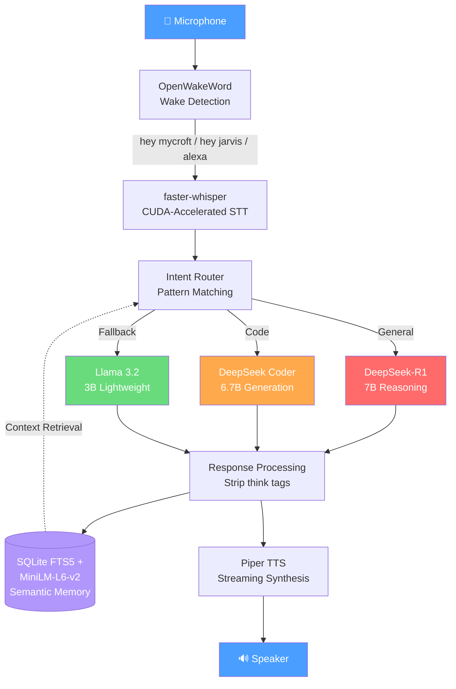

[](https://github.com/Bailie-L/VelaNova/actions/workflows/ci.yml)

# VelaNova 🎙️

**Fully offline voice assistant powered by local LLMs — no cloud, no telemetry, no compromise.**

VelaNova is a privacy-first voice assistant that runs entirely on your hardware. It combines wake word detection, GPU-accelerated speech recognition, local large language model inference, and streaming text-to-speech into a seamless voice interaction loop.

> Built in ~3 months as a solo AI-assisted development project. Every conversation stays on your machine.

---

## Features

- **100% Offline** — Zero cloud dependencies. No data leaves your machine.
- **Wake Word Detection** — Supports multiple trigger phrases via OpenWakeWord
- **GPU-Accelerated STT** — CUDA-powered Whisper for fast, accurate transcription
- **Multi-Model LLM Routing** — Intent-based routing between reasoning (DeepSeek-R1 7B) and code generation (DeepSeek Coder 6.7B) models
- **Streaming TTS** — Low-latency neural speech synthesis via Piper with parallel chunked playback
- **Semantic Memory** — SQLite FTS5 + sentence-transformers for context-aware conversations
- **Session Persistence** — Resume conversations within a 24-hour window
- **Chain-of-Thought Filtering** — Strips internal reasoning tokens before speech output

## Architecture




## Hardware Requirements

| Component | Minimum | Recommended |
|-----------|---------|-------------|
| GPU | NVIDIA with 6GB VRAM | RTX 2070+ (8GB VRAM) |
| RAM | 16 GB | 32 GB |
| Storage | 15 GB (models + app) | SSD recommended |
| Audio | Microphone + speakers | USB mic for clarity |

## Software Requirements

- Linux (tested on Pop!_OS 24.04 / Ubuntu-based)
- Python 3.10+
- CUDA 12.x with cuDNN
- Docker + Docker Compose (for Ollama)
- PulseAudio

## Quick Start
```bash
# 1. Clone and set up
git clone https://github.com/Bailie-L/VelaNova.git
cd VelaNova
python3 -m venv .venv
source .venv/bin/activate
pip install -r requirements.txt  # See Dependencies section

# 2. Start Ollama via Docker
cd compose && docker compose up -d && cd ..

# 3. Pull required models
docker exec vela_ollama ollama pull deepseek-r1:7b
docker exec vela_ollama ollama pull deepseek-coder:6.7b
docker exec vela_ollama ollama pull llama3.2:3b

# 4. Download Whisper and Piper models (see docs/OPERATIONS.md)

# 5. Run VelaNova
python3 orchestrator/voice_loop.py
```

## Key Dependencies

| Package | Purpose |
|---------|---------|
| faster-whisper | CUDA-accelerated speech recognition |
| openwakeword | Wake word detection |
| sentence-transformers | Semantic memory embeddings |
| sounddevice | Audio capture |
| Piper TTS | Neural text-to-speech |
| Ollama | Local LLM serving |

## Configuration

All settings are in `config/voice.yaml`. Key sections:

- **wake** — Trigger phrases, sensitivity
- **stt** — Whisper model, CUDA settings
- **llm** — Model selection, timeouts, context window
- **tts** — Voice, streaming parameters
- **memory** — Session timeout, semantic search threshold

## Performance

| Operation | Typical Latency |
|-----------|----------------|
| Wake detection | Real-time |
| Speech-to-text | ~500-800ms |
| LLM (general) | ~5-10s (7B model) |
| LLM (code) | ~1-2s (6.7B model) |
| TTS streaming | ~200-450ms to first audio |

## Development Phases

VelaNova was built through 8 rigorous phases, each with formal acceptance criteria:

| Phase | Description | Status |
|-------|-------------|--------|
| A | Foundations & scaffolding | ✅ Complete |
| B | Core services (Ollama + WebUI) | ✅ Complete |
| C | Voice loop (wake + STT + TTS) | ✅ Complete |
| D | Semantic memory system | ✅ Complete |
| E | Developer ergonomics | ✅ Complete |
| F | CUDA hardening & offline parity | ✅ Complete |
| G | Streaming TTS with parallel playback | ✅ Complete |
| H | Multi-model routing (DeepSeek 7B/6.7B) | ✅ Complete |

Full phase documentation is available in `docs/`.

## Project Structure
VelaNova/
├── orchestrator/          # Core Python application
│   ├── voice_loop.py      # Main orchestration loop (1,979 lines)
│   ├── memory_store.py    # Semantic memory module
│   ├── check_env.py       # Environment validator
│   └── mic_probe.py       # Microphone diagnostics
├── config/                # YAML configuration
├── compose/               # Docker Compose for Ollama + WebUI
├── docs/                  # Phase acceptance & operations docs
├── tools/                 # Utility scripts
├── models/                # LLM, STT, TTS, wake models (not in repo)
├── data/                  # SQLite memory database (not in repo)
└── logs/                  # Application logs (not in repo)

## License

MIT License — see [LICENSE](LICENSE) for details.

## Acknowledgments

Built with AI-assisted development using Claude (Anthropic) and GPT (OpenAI). This project demonstrates that sophisticated voice AI systems can be developed by individuals through effective collaboration with AI development tools.
